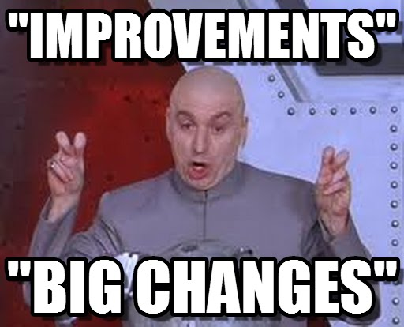

# Feature Flags

---

## Wait what flags?

(Btw, also known as feature toggles or switches.)

===

### Simply taken

Turn certain functionality on and of during runtime, without deploying new code.

===

### Where is it used?

- Twitter, Facebook, Youtube, Twitch, etc.
- Web Browsers (see [chrome://flags](chrome://flags))
- GitHub ([GitHub blog post](https://github.blog/2021-04-27-ship-code-faster-safer-feature-flags/))

===

### Use-Cases

- UI Changes (layout, verbiage/copy)
- Payment Providers (enabling/disabling)
- Gradual Rollouts (rolling out to portions of your user base at a time)
- Single source of truth for pricing changes

---

## Why?

===

### Time

===

### Best case - continuous delivery

Projects can take upwards of 20 to 30 minutes to build and test

Per environment

===

### Worst case - Mobile apps

Easily can take a week

- Review process
- Possible changes

---

## Options

===

### PROPRIETARY (SAAS ONLY)

- LaunchDarkly
- Split.io
- AWS AppConfig
- Firebase RemoteConfig
- DevCycle
- Optimizely

===

### OPEN SOURCE (DOCKER-BASED OR SAAS)

- Unleash
- GrowthBook
- Flagsmith
- Flipt
- FeatureHub

===

### CLIENT BASED (JUST REMOTE JSON):

- Vexilla (Open Source, very simple)

---

## Have I used these in the past?

===

### Optimizely

- Just out of curiosity
- In an old React pet project
- I still have the config

===

### Vexilla

- Couldn't fully configure it yet
- Wanted to check it working with GitHub
- [Docs](https://vexilla.dev)

===

### Split.io

- Just checked out the platform

---

## Credits

Inspired by [@cmgriffing](https://twitch.com/cmgriffing) (building Vexilla)

---

## That's it ¯\\\_(ツ)\_/¯
